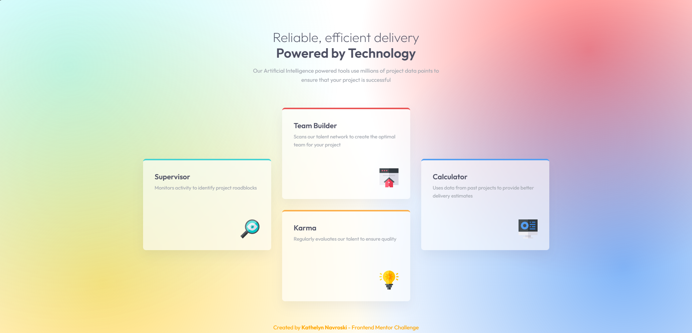

# Frontend Mentor - Four card feature section solution

This is a solution to the [Four card feature section challenge on Frontend Mentor](https://www.frontendmentor.io/challenges/four-card-feature-section-weK1eFYK). Frontend Mentor challenges help you improve your coding skills by building realistic projects. 

## Table of contents

- [Overview](#overview)
  - [The challenge](#the-challenge)
  - [Screenshot](#screenshot)
  - [Links](#links)
- [My process](#my-process)
  - [Built with](#built-with)
  - [What I learned](#what-i-learned)
  - [Continued development](#continued-development)
- [Author](#author)

---

## Overview

### The challenge

Users should be able to:

- View the optimal layout for the site depending on their device's screen size
- See hover states for interactive elements
- Experience an enhanced visual style featuring a glassmorphism aesthetic and a smooth dynamic Aurora background

### Screenshot



### Links

- Solution URL: [GitHub Repository](https://github.com/Kathelyn-Navroski/four-card-feature-section)
- Live Site URL: [GitHub Pages](https://kathelyn-navroski.github.io/four-card-feature-section/)

---

## My process

### Built with

- Semantic HTML5 markup
- CSS custom properties
- Flexbox layout
- Mobile-first / Responsive Workflow
- [Outfit Font](https://fonts.google.com/specimen/Outfit) - Google Fonts
- Custom Glassmorphism UI (`backdrop-filter`)

### What I learned

In this project, I strengthened my CSS Flexbox skills by constructing an asymmetric multi-column layout. I learned how to pair structural container wrapping with flex properties to align items cleanly across both mobile and desktop screens.

Additionally, I integrated modern styling techniques, using pure CSS radial gradients to create an "Aurora" background and backdrop blurring for the translucent cards:

```css
.card {
  background-color: rgba(255, 255, 255, 0.7);
  backdrop-filter: blur(12px);
  -webkit-backdrop-filter: blur(12px);
}
